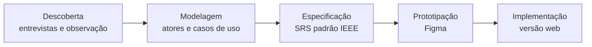

# JurisDoc — Gestão Documental para Escritórios de Advocacia

> Sistema web que organiza o fluxo de documentos de um escritório de advocacia: do recebimento à análise de pertinência, com controle de pendências, status e visão gerencial em tempo real.

🔗 **[Acessar o sistema](https://amandapalacioo.github.io/sistema-juridico/)**

| Usuário de demonstração | |
|---|---|
| E-mail | `usuario@jurisdoc.com.br` |
| Senha | `1234` |

---

##  O problema

Escritórios de advocacia recebem documentos o tempo todo — procurações, contratos, certidões, laudos, comprovantes — por WhatsApp e presencialmente. No cenário estudado:

- os arquivos ficam em pastas no servidor, com apenas um registro genérico no ERP jurídico;
- a análise só acontece perto do prazo processual, quando já é tarde para pedir complementos;
- não existe visão consolidada do que está pendente, incompleto ou ilegível;
- o resultado é retrabalho, solicitações repetidas ao cliente e risco de perda de prazo.

## A solução

Um sistema **complementar ao ERP jurídico** — não um repositório de arquivos, mas uma ferramenta que modela os conceitos do próprio domínio:

- **Classificação de pertinência:** `Pertinente` · `Não Pertinente` · `Necessita Complemento`
- **Ciclo de status:** `Recebido` → `Pendente de Análise` → `Analisado` / `Aguardando Complemento`
- **Pendências documentais** vinculadas ao documento e ao cliente
- **Dashboard** com o que exige atenção agora
- **Controle de acesso por perfil**

### Quem usa

| Perfil | Papel no fluxo |
|---|---|
| Recepcionista | Recebe, digitaliza e cadastra |
| Advogada Júnior | Vincula ao cliente, confere, atualiza e registra pendências |
| Advogada Sênior | Analisa e decide a pertinência |
| Controller Jurídico | Monitora fluxo, pendências e indicadores |
| Administrador | Gerencia usuários e permissões |

### Telas

1. **Login** — autenticação individual
2. **Dashboard** — documentos recentes, pendentes de análise, aguardando complemento e pendências abertas
3. **Cadastro de Documento** — registro com validação e vínculo ao cliente
4. **Consulta** — busca por cliente, tipo, status, classificação, data e pendência
5. **Classificação Documental** — análise de pertinência com observações

<!-- Adicione prints em docs/img/ e descomente:

-->

---

## Como o projeto foi construído

O sistema foi desenvolvido seguindo um processo completo de engenharia de requisitos, partindo de usuários reais até o software funcionando.



### 1. Descoberta

Levantamento com **quatro stakeholders reais** do escritório, combinando entrevista semiestruturada, observação participante, análise documental e brainstorming. O roteiro cobriu contexto do negócio, papéis, fluxos de trabalho, dados necessários e restrições, com perguntas específicas para cada perfil.

### 2. Modelagem

Mapeamento do **fluxo operacional atual × proposto**, identificação de atores (incluindo o ERP como sistema externo) e diagrama de casos de uso por perfil.

### 3. Especificação

Documento de Especificação de Requisitos de Software (SRS) no padrão IEEE, com:

- **8 módulos funcionais**, cada um com prioridade e sequência estímulo-resposta: cadastro e vínculo ao cliente · consulta e recuperação · análise e classificação · pendências e complementações · status e dashboard · atualização · controle de acesso · integração com sistemas externos
- **Requisitos de interface** com usuário, hardware, software e comunicação
- **Requisitos não funcionais:** desempenho, segurança, usabilidade, confiabilidade, manutenibilidade e portabilidade
- **Regras de negócio** para cadastro, classificação, pendências, acesso e integração
- **Matriz de rastreabilidade** ligando cada necessidade levantada aos requisitos, regras e casos de uso
- Glossário do domínio jurídico-documental

Convenções: `N` Necessidade · `RF` Requisito Funcional · `RNF` Não Funcional · `RB` Regra de Negócio · `UC` Caso de Uso · `UI/HW/SW/COM` Interfaces, com redação normativa e verificável ("o sistema deve…").

### 4. Prototipação

Protótipo navegável no Figma para validar os fluxos de navegação antes da implementação.

### 5. Implementação

Versão funcional em HTML, CSS e JavaScript, publicada via GitHub Pages, implementando os fluxos principais especificados.

---

## Interação Humano-Computador

> _Em breve — personas, análise de tarefas e avaliação de usabilidade do sistema._

---

## Estrutura

```
sistema-juridico/
├── index.html     # aplicação (GitHub Pages)
├── css/           # estilos
├── js/            # lógica da aplicação
└── README.md
```

## Ferramentas

HTML · CSS · JavaScript · GitHub Pages · Figma · LaTeX · IEEE 830

## Autora

**Amanda da Silva Palacio** — Engenharia de Software, Universidade Estadual de Maringá
[GitHub](https://github.com/amandapalacioo)
