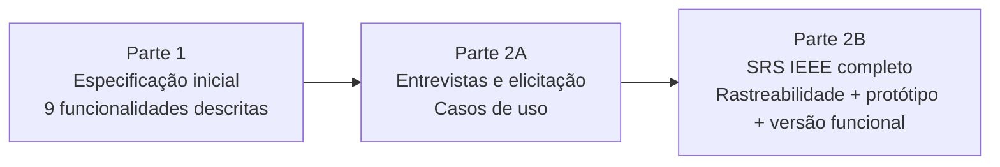

# ⚖️ JurisDoc — Sistema de Organização de Documentos Jurídicos

> Sistema web de apoio à gestão documental para escritórios de advocacia: cadastro, vinculação ao cliente, **classificação de pertinência**, controle de pendências e acompanhamento de status.

Projeto acadêmico desenvolvido no curso de **Engenharia de Software da Universidade Estadual de Maringá (UEM)** em 2026, trabalhado sob duas perspectivas:

| Visão | Disciplina | Foco |
|---|---|---|
| 📋 **Engenharia de Requisitos** | Processo de Software e Engenharia de Requisitos | Levantamento com stakeholders, especificação formal (IEEE 830/SRS), casos de uso, rastreabilidade |
| 🎨 **Interação Humano-Computador** | IHC | Usuários, tarefas, protótipo e avaliação de usabilidade *(em construção)* |

🔗 **[Versão funcional](https://amandapalacioo.github.io/sistema-juridico/)**

---

## 🧩 O problema

Em um escritório de advocacia, documentos chegam o tempo todo — procurações, contratos, certidões, laudos, comprovantes, decisões judiciais. Sem um fluxo padronizado, o resultado é:

- documentos difíceis de localizar;
- nenhuma visão consolidada do que está pendente;
- classificação documental frágil (o que serve para o processo? o que falta?);
- retrabalho causado por registros incompletos ou inconsistentes.

## 💡 A solução

Um sistema **complementar ao ERP jurídico** do escritório — não um simples repositório de arquivos, mas uma ferramenta que modela conceitos do próprio domínio jurídico:

- **Classificação de pertinência:** `Pertinente` · `Não Pertinente` · `Necessita Complemento`
- **Status do documento:** `Recebido` → `Pendente de Análise` → `Analisado` / `Aguardando Complemento`
- **Pendências documentais** vinculadas ao documento e ao cliente
- **Dashboard** com o que exige atenção
- **Controle de acesso por perfil**

### Perfis de usuário

| Perfil | Papel no fluxo |
|---|---|
| Recepcionista | Recebimento e cadastro inicial |
| Advogada Júnior | Consulta, conferência, atualização e apoio à análise |
| Advogada Sênior | Validação e decisão sobre pertinência |
| Controller Jurídico | Monitoramento de fluxo, pendências e indicadores |
| Administrador | Usuários, perfis e permissões |

---

## 📋 Visão 1 — Engenharia de Requisitos

O projeto foi construído de forma **incremental em três entregas**. Cada etapa incorporou o feedback da anterior — o que torna o repositório também um registro de como a especificação amadureceu.



#### Parte 1 — Especificação inicial

- Estratégia de comunicação com **4 stakeholders reais** (recepcionista, advogada júnior, advogada sênior, controller jurídico), técnicas de levantamento e informações essenciais
- Introdução (propósito, escopo e definições), descrição geral com 4 classes de usuários, ambiente operacional, restrições e premissas
- Prévia de 9 funcionalidades com exemplos de uso
- ✅ **Destaque do professor:** a seção de definições foi apontada como *a mais completa entre os trabalhos da turma* ("documento pertinente", "não pertinente", "necessita complemento", "fase processual"…)
- 🔧 **A melhorar:** formalizar requisitos (RF-01, "o sistema deve…") e consolidar funcionalidades fragmentadas — classificar, observar, mudar status e corrigir são operações de um mesmo fluxo de gestão documental

#### Parte 2A — Entrevista e elicitação

- **Técnicas:** entrevista semiestruturada, observação participante, análise documental e brainstorming
- **Roteiro** com perguntas sobre negócio, papéis, funcionalidades, RNFs, fluxos, dados e perguntas específicas para cada stakeholder
- **Achados:** documentos chegam por WhatsApp e presencialmente, ficam em pastas no servidor com apenas um registro genérico no ERP, e só são analisados perto do prazo — gerando complementações de última hora, retrabalho e risco de perda de prazo
- **Necessidades levantadas:** controle centralizado, classificação de pertinência, controle de status, visualização de pendências, rastreabilidade, dashboard e integração com o ERP
- **Modelagem:** atores, casos de uso por perfil, fluxo operacional atual × proposto e diagrama de casos de uso
- ✅ **Destaque do professor:** planejamento da entrevista "muito bom"; a cobertura de stakeholders fortaleceu a elicitação
- 🔧 **A melhorar:** usar `<<include>>` nas dependências entre casos de uso, modelar o ERP como ator externo, incluir UC de autenticação e generalizar as advogadas em um ator "Advogada"

#### Parte 2B — SRS completo

- Documento de 69 páginas no padrão IEEE (detalhado abaixo), já incorporando os feedbacks anteriores: requisitos numerados e verificáveis, módulos consolidados, autenticação, ERP como sistema externo
- Protótipo navegável no Figma + **versão funcional publicada**
- ✅ **Destaque do professor:** entrega "bem completa em termos de escopo, rastreabilidade e protótipo"; a versão funcional "foi além do protótipo navegável"

### O que a especificação contém

- **8 módulos funcionais** com descrição, prioridade e sequência estímulo-resposta:
  cadastro e associação ao cliente · consulta e recuperação · análise e classificação de pertinência · pendências e complementações · status e dashboard · atualização · controle de acesso · integração com sistemas externos
- **Requisitos de interface externa:** usuário (UI-01…UI-40), hardware (HW), software (SW) e comunicação (COM)
- **Requisitos não funcionais:** desempenho, segurança operacional, segurança da informação, usabilidade, confiabilidade, manutenibilidade, portabilidade e adequação ao domínio
- **Regras de negócio** de cadastro, classificação, pendências, acesso e integração
- **Casos de uso** com atores, descrições principais e diagrama
- **Matriz de rastreabilidade** Necessidade → RF → RNF → Regra de Negócio → Caso de Uso
- Glossário do domínio jurídico-documental, modelos de análise e lista de itens a definir (TBD)

### Convenções adotadas

`N` Necessidade · `RF` Requisito Funcional · `RNF` Não Funcional · `RB` Regra de Negócio · `UC` Caso de Uso · `UI/HW/SW/COM` Interfaces — numeração sequencial por categoria e redação com verbos normativos ("o sistema deve…") para garantir requisitos verificáveis.

### Lições aprendidas

- **Funcionalidade ≠ operação:** classificar, anotar e mudar status são ações sobre o mesmo objeto; agrupá-las em módulos coesos deixou a especificação mais robusta.
- **Requisito precisa ser verificável:** identificador, verbo normativo e, idealmente, ator, prioridade e critério de aceitação individuais.
- **RNFs pedem métricas** (tempo de resposta, taxa de erro) para serem testáveis.
- **Diagrama conta a mesma história que o fluxo:** responsabilidades, dependências (`include`) e sistemas externos precisam bater com o processo descrito.
- **Rastreabilidade de ponta a ponta:** Necessidade → RF → RNF → Regra → Caso de Uso → **tela do protótipo**.

---

## 🎨 Visão 2 — Interação Humano-Computador

> _Seção em construção — será preenchida com os trabalhos de IHC (personas, análise de tarefas, protótipos, avaliação de usabilidade)._

---

## 🖼️ Protótipo

Telas prototipadas no Figma e implementadas na versão funcional:

1. Login
2. Dashboard
3. Cadastro de Documento
4. Consulta de Documentos
5. Classificação Documental

<!-- Adicione prints em docs/img/ e descomente:

-->

### Acesse a versão funcional

🔗 https://amandapalacioo.github.io/sistema-juridico/

| Usuário de demonstração | |
|---|---|
| E-mail | `Lucas@jurisdoc.com.br` |
| Senha | `1234` |

---

## 📁 Estrutura do repositório

```
sistema-juridico/
├── index.html     # versão funcional (publicada via GitHub Pages)
├── css/           # estilos
├── js/            # lógica da aplicação (JavaScript puro)
└── README.md
```

> Os documentos de cada entrega (PDFs) e os materiais de IHC serão adicionados em `docs/`.

## 🛠️ Ferramentas

Figma · HTML/CSS/JavaScript · GitHub Pages · LaTeX · IEEE 830 (SRS)

## 👩‍💻 Autora

**Amanda da Silva Palacio** — Engenharia de Software, UEM
[GitHub](https://github.com/amandapalacioo)

---

<sub>Projeto acadêmico — Processo de Software e Engenharia de Requisitos (Prof. Lucas de Oliveira Teixeira) e Interação Humano-Computador, UEM, 2026.</sub>
