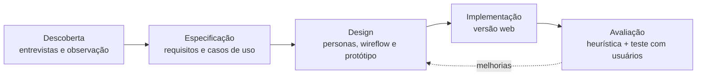

# ⚖️ JurisDoc — Gestão Documental para Escritórios de Advocacia

> Sistema web que organiza o fluxo de documentos de um escritório de advocacia: do recebimento à análise de pertinência, com controle de pendências, status e visão gerencial em tempo real.

🔗 **[Acessar o sistema](https://amandapalacioo.github.io/sistema-juridico/)**

| Usuário de demonstração | |
|---|---|
| E-mail | `Lucas@jurisdoc.com.br` |
| Senha | `1234` |

---

## 🧩 O problema

Escritórios de advocacia recebem documentos o tempo todo — procurações, contratos, certidões, laudos, comprovantes — por WhatsApp e presencialmente. No cenário estudado:

- os arquivos ficam em pastas no servidor, com apenas um registro genérico no ERP jurídico;
- a análise só acontece perto do prazo processual, quando já é tarde para pedir complementos;
- não existe visão consolidada do que está pendente, incompleto ou ilegível;
- o resultado é retrabalho, solicitações repetidas ao cliente e risco de perda de prazo.

## 💡 A solução

Um sistema **complementar ao ERP jurídico** — não um repositório de arquivos, mas uma ferramenta que modela os conceitos do próprio domínio:

- **Classificação de pertinência:** `Pertinente` · `Não Pertinente` · `Necessita Complemento`
- **Ciclo de status:** `Recebido` → `Pendente de Análise` → `Analisado` / `Aguardando Complemento`
- **Pendências documentais** vinculadas ao documento e ao cliente
- **Dashboard** com o que exige atenção agora
- **Controle de acesso por perfil**

### Quem usa

| Perfil | Papel no fluxo |
|---|---|
| Recepcionista | Recebe, digitaliza e cadastra |
| Advogada Júnior | Vincula ao cliente, confere, atualiza e registra pendências |
| Advogada Sênior | Analisa e decide a pertinência |
| Controller Jurídico | Monitora fluxo, pendências e indicadores |
| Administrador | Gerencia usuários e permissões |

### Telas

1. **Login** — autenticação individual
2. **Dashboard** — documentos recentes, pendentes de análise, aguardando complemento e pendências abertas
3. **Cadastro de Documento** — registro com validação e vínculo ao cliente
4. **Consulta** — busca por cliente, tipo, status, classificação, data e pendência
5. **Classificação Documental** — análise de pertinência com observações

<!-- Adicione prints em docs/img/ e descomente:

-->

---

## 🛠️ Como o projeto foi construído

O JurisDoc foi desenvolvido ponta a ponta: da conversa com usuários reais até o software publicado e testado por pessoas que nunca tinham visto o sistema.



### 1. Descoberta

Levantamento com **quatro stakeholders reais** de um escritório de advocacia, combinando entrevista semiestruturada, observação participante, análise documental e brainstorming. O roteiro cobriu contexto do negócio, papéis, fluxos de trabalho, dados necessários e restrições, com perguntas específicas para cada perfil. O resultado foi o mapeamento do **fluxo operacional atual × proposto** e das necessidades que guiaram todo o resto.

### 2. Especificação

Documento de Especificação de Requisitos de Software (SRS) no padrão IEEE, com:

- **8 módulos funcionais**, cada um com prioridade e sequência estímulo-resposta: cadastro e vínculo ao cliente · consulta e recuperação · análise e classificação · pendências e complementações · status e dashboard · atualização · controle de acesso · integração com sistemas externos
- **Requisitos de interface** com usuário, hardware, software e comunicação
- **Requisitos não funcionais:** desempenho, segurança, usabilidade, confiabilidade, manutenibilidade e portabilidade
- **Regras de negócio** para cadastro, classificação, pendências, acesso e integração
- **Casos de uso** com atores (incluindo o ERP como sistema externo) e diagrama
- **Matriz de rastreabilidade** ligando cada necessidade levantada aos requisitos, regras e casos de uso
- Glossário do domínio jurídico-documental

Convenções: `N` Necessidade · `RF` Requisito Funcional · `RNF` Não Funcional · `RB` Regra de Negócio · `UC` Caso de Uso · `UI/HW/SW/COM` Interfaces, com redação normativa e verificável ("o sistema deve…").

### 3. Design centrado no usuário

**Personas** construídas a partir dos perfis levantados:

| | Mariana Souza — Advogada Sênior | Lucas Almeida — Recepcionista |
|---|---|---|
| **Quer** | Analisar rápido, identificar o que é relevante, evitar retrabalho | Registrar rápido e sem erro, facilitar o trabalho das advogadas |
| **Dores** | Documentos desorganizados, incompletos ou ilegíveis; dificuldade de localizar informação | Não saber o que é importante registrar; medo de cadastrar errado; falta de padrão nos documentos |

A partir delas foram desenhados o **wireflow** (Login → Dashboard → Cadastro → Análise → Consulta) e o **protótipo de alta fidelidade** no Figma, com cores semânticas para status, tipografia legível, ícones e hierarquia visual que destaca o que exige ação.

### 4. Implementação

Versão funcional em HTML, CSS e JavaScript, publicada via GitHub Pages, implementando os fluxos principais especificados.

### 5. Avaliação de usabilidade

O sistema passou por duas avaliações complementares.

**Avaliação heurística** — inspeção baseada nas 10 heurísticas de Nielsen, com cada problema classificado por severidade. Foram encontrados 10 problemas, entre eles feedback de carregamento pouco evidente, falta de validação em tempo real, mensagens de erro pouco específicas e ausência de recursos de acessibilidade.

**Teste com usuários** — 13 participantes executaram um roteiro de tarefas (login, mensagens de erro, cadastro, busca, detalhamento, edição e exclusão de documentos) e responderam ao questionário **SUS (System Usability Scale)** e a perguntas abertas. 12 dos 13 nunca tinham usado um sistema jurídico ou de gestão documental — um bom teste de aprendizado para novos usuários.

<table>
<tr>
<td align="center"><h2>≈ 71</h2>pontuação SUS<br/><sub>acima da referência de 68</sub></td>
<td align="center"><h2>83%</h2>acharam o sistema<br/>fácil de usar</td>
<td align="center"><h2>83%</h2>sentiram confiança<br/>ao usar</td>
<td align="center"><h2>85%</h2>não acharam a navegação<br/>confusa</td>
</tr>
</table>

**O que os usuários apontaram**

| Área | Achado | Ação planejada |
|---|---|---|
| Busca | O campo de busca recarrega a cada letra digitada e perde o foco | Busca com *debounce*, mantendo o foco no campo |
| Busca | Barra de pesquisa duplicada com os filtros em algumas abas | Unificar busca e filtros |
| Dashboard | Cards apenas informam números | Cards clicáveis que levam direto à lista filtrada |
| Dashboard | Cores de "Pendente" e "Aguardando Complemento" geram confusão | Revisar a paleta de status por urgência |
| Dashboard | Período exibido não fica claro e não pode ser escolhido | Seletor de período visível |
| Documentos | Filtro de status inicia em "Pendente" | Iniciar em "Todos" |
| Documentos | Abrir documento só pelo ícone de olho | Linha inteira clicável, ordenação e mais itens por página |
| Cadastro | Seleção de cliente em lista longa | Campo com autocompletar |
| Cadastro | Forma de recebimento fora do padrão dos demais campos e sem guardar o contato de origem | Padronizar o controle e registrar e-mail/WhatsApp de origem |
| Cadastro | Aceita data de recebimento futura e não mostra prévia do arquivo | Validar a data e exibir miniatura do anexo |
| Clientes | Não é possível cadastrar nem abrir o detalhe do cliente | Cadastro de clientes e página com histórico documental |
| Login | Sem opção de exibir a senha | Botão de mostrar/ocultar senha |

**O que funcionou bem:** distribuição das informações, fluxo intuitivo mesmo para quem nunca usou um sistema jurídico e integração entre as funcionalidades (69% concordaram que estão bem integradas).

---

## 🗺️ Próximos passos

- [ ] Corrigir a busca (debounce + foco) e unificar busca e filtros
- [ ] Tornar os cards do dashboard navegáveis e adicionar seletor de período
- [ ] Revisar cores de status e padrões de formulário
- [ ] Cadastro e página de detalhe de clientes com histórico documental
- [ ] Validações no cadastro (datas, prévia de anexo, contato de origem)
- [ ] Acessibilidade e mensagens de erro mais específicas
- [ ] Nova rodada de teste SUS após as melhorias

---

## 📁 Estrutura

```
sistema-juridico/
├── index.html     # aplicação (GitHub Pages)
├── css/           # estilos
├── js/            # lógica da aplicação
└── README.md
```

## 🧰 Ferramentas

HTML · CSS · JavaScript · GitHub Pages · Figma · LaTeX · IEEE 830 · Heurísticas de Nielsen · SUS

## 👩‍💻 Autora

**Amanda da Silva Palacio** — Engenharia de Software, Universidade Estadual de Maringá
[GitHub](https://github.com/amandapalacioo)
